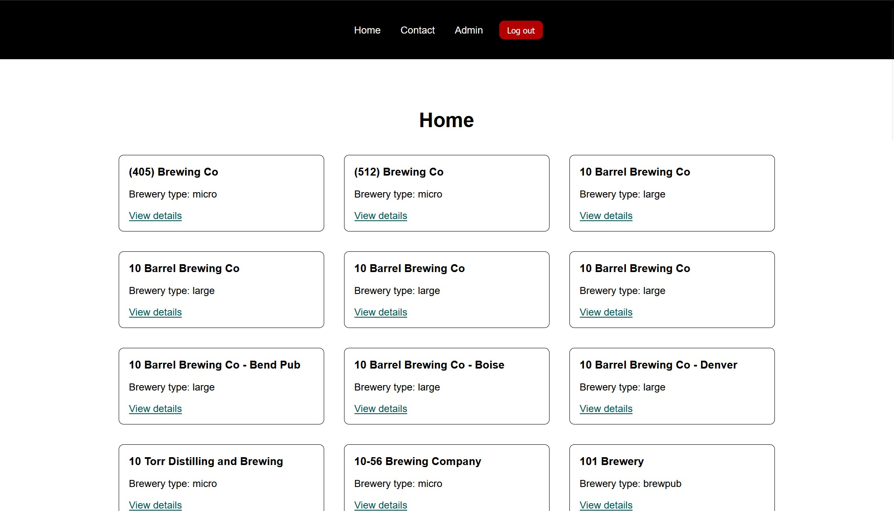
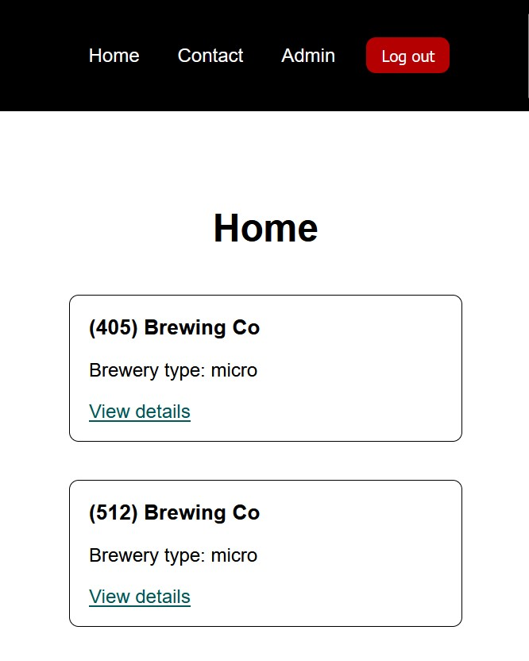

# JS Frameworks Course Assignment




The course assignment was to create a simple React app with login functionality and fetching data using REST api.

## Description

- Log in
To log in, you need to use your own strapi installation and login credentials. You may modify the BASE_URL and TOKEN_PATH in the api.jsx file in the constants folder to fit your local environment.

- List
The app displays a list with a few properties. You can click each item.

- List item details
When you click on an item, you get to a details page that retreives a parameter and fetches details of each item.

- Contact form
The contact form has validation handling using yup. The contact form is not functional.

- Admin
The admin page only appears to logged in users, and it only displays a simple heading.


## Built With
- [React](https://reactjs.org/)

## Getting Started

### Installing

1. Clone the repo:

```bash
git clone git@github.com:NoroffFEU/js-frameworks-course-assignment-vildehalvorsen.git
```
2. Get to the root folder:

```bash
cd js-frameworks_ca
```

2. Install the dependencies:

```bash
npm install
```

### Running
1. Get to the root folder:

```bash
cd js-frameworks_ca
```

2. Inside the root folder, run the following commands:

```bash
npm start
```
